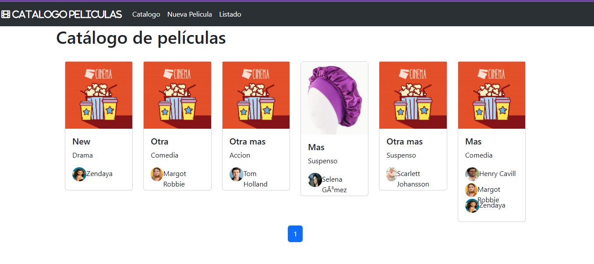
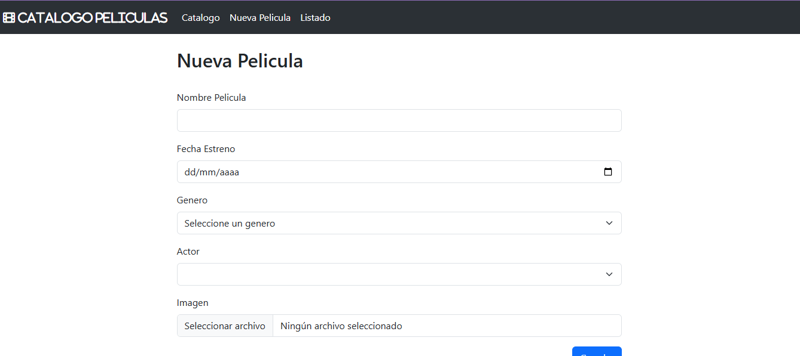
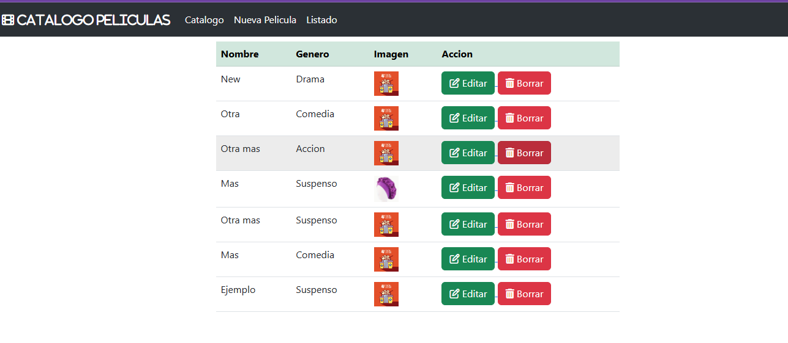
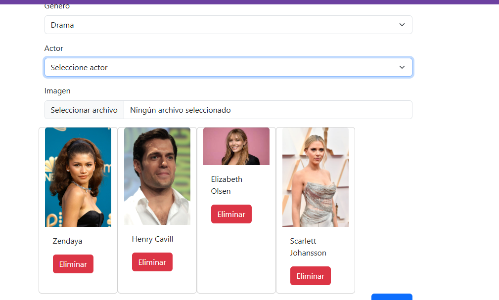
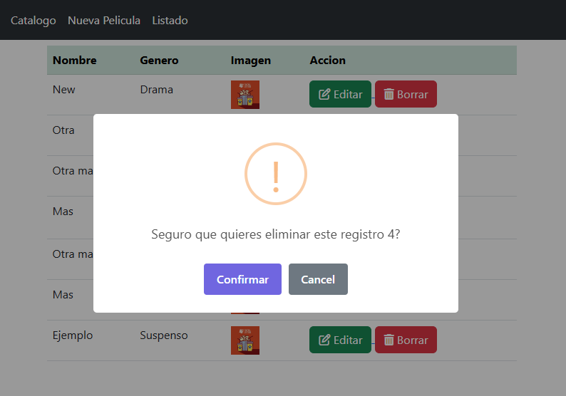

<h1 align="center"><b>🖥️ CRUD Peliculas con SpringBoot</b></h1>
<h3>🌼 Proyecto de CRUD de catalogo de peliculas con el gramework spring</h3><br>

<p align="center"></p> 
<p align="center"></p> 
<p align="center"></p>
<p align="center"></p>
<p align="center"></p>

## Construido con 🛠️

_Herramientas Utilizadas_

- [Java 17.0.13](https://www.java.com/es/) - Lenguaje Princiapl
- [Spring Boot v3.1.1](https://nodejs.org/es/) - Framework
- [MySql](https://www.mysql.com/) - Gestor de BD
- [thymeleaf](http://www.thymeleaf.org) - Plantillas para trabajar Html.
- [SweetAlert](https://sweetalert2.github.io/#download) - Alertas.
- Html/Css/Boostrap - Lenguajes para el FrontEnd

## Pasos para el uso

**1. Clonar repositorio**

**2. Asegurarse de tener instalado localmente java y mysql**

**3. Configure en el archivo de aplication.properties la info de la bd**

**4. Ingrese algun ditor de codigo como Visual Studio pára ejecutar el programa**

**4.1. Procurar despues de la primera ejecucion comentar las siguinetes linesas del archivo de aplication.properties**

```bash
#spring.sql.init.mode=always
# spring.jpa.hibernate.ddl-auto=update
# spring.sql.init.data-locations=classpath:script.sql
```

**5. Ingrese a la url**

```bash
  http://localhost:8080/home
```

## Autores ✒️

- **Karen Vargas** - _Trabajo Inicial_ - [KarenVargas](https://github.com/Karen11Vargas)

## Adicionalmente🎁

- Mi primer proyecto con Spring 📢
- Ejecuta Localmente 😕
